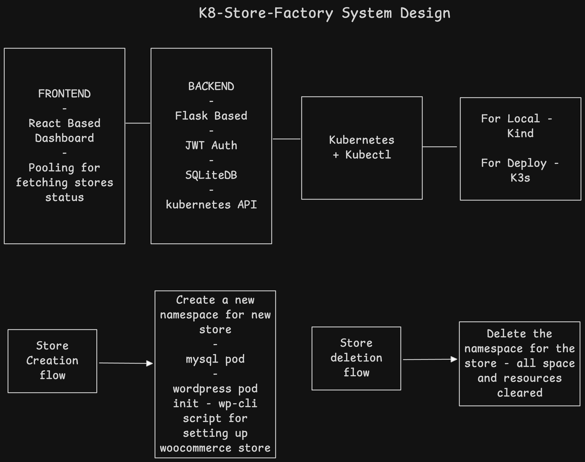
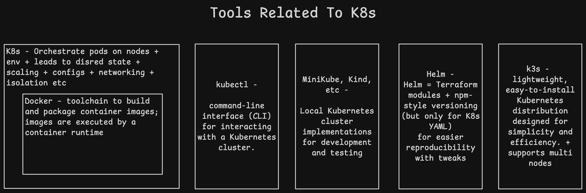
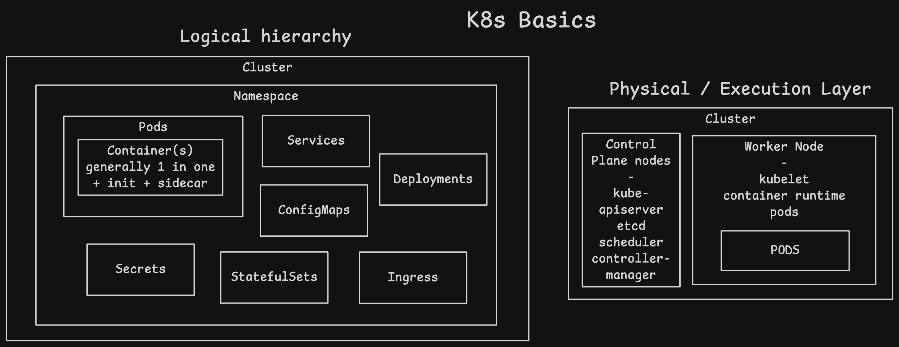

# K8s Store Factory

Multi-tenant WooCommerce store provisioning platform on Kubernetes. Deploy isolated WordPress/WooCommerce stores with automated setup, quota management, and dynamic ingress routing.

## Architecture



**Stack:**
- Frontend: React dashboard with JWT authentication
- Backend: Flask REST API with Kubernetes Python client
- Database: SQLite for user/store metadata
- Orchestration: Dynamic namespace creation with MySQL + WordPress pods
- Storage: Per-store PVCs with quota enforcement





## Deliverables

```
k8s-store-factory/
├── backend/              # Flask API for store management
│   ├── app.py           # Main API endpoints
│   ├── store_manager.py # Store creation/deletion logic
│   ├── k8s_client.py    # Kubernetes API wrapper
│   ├── database.py      # SQLite operations
│   ├── models.py        # User/Store models
│   └── templates/       # K8s manifests (MySQL, WordPress, Ingress)
├── frontend/            # React dashboard
│   └── src/
│       ├── App.jsx      # Store management UI
│       └── Login.jsx    # Authentication
├── wordpress-chart/     # Helm chart for platform deployment
│   ├── templates/       # Backend & frontend K8s resources
│   ├── values.yaml      # Base configuration
│   ├── values-dev.yaml  # Local development overrides
│   └── values-prod.yaml # Production configuration
└── docs/
    └── assets/          # Architecture diagrams
```

## Local Setup (Kind/Minikube)

### Prerequisites

```bash
# Install tools
brew install kind kubectl helm

# Or for Minikube
brew install minikube
```

### 1. Create Kubernetes Cluster

**Using Kind:**
```bash
kind create cluster --name store-factory

# Enable ingress
kubectl apply -f https://raw.githubusercontent.com/kubernetes/ingress-nginx/main/deploy/static/provider/kind/deploy.yaml
```

**Using Minikube:**
```bash
minikube start --driver=docker
minikube addons enable ingress
```

### 2. Build and Load Images

```bash
# Build backend
cd backend
docker build -t store-factory-backend:dev .

# Build frontend
cd ../frontend
docker build -t store-factory-frontend:dev \
  --build-arg VITE_API_URL=http://api.storefactory.local/api .

# Load into Kind (skip for Minikube)
kind load docker-image store-factory-backend:dev --name store-factory
kind load docker-image store-factory-frontend:dev --name store-factory
```

### 3. Deploy with Helm

```bash
cd wordpress-chart

helm install store-factory . -f values-dev.yaml \
  --set backend.image.tag=dev \
  --set frontend.image.tag=dev
```

### 4. Configure Local DNS

```bash
# Add to /etc/hosts
echo "127.0.0.1 storefactory.local api.storefactory.local" | sudo tee -a /etc/hosts

# Port forward ingress controller (if using Kind)
kubectl port-forward -n ingress-nginx service/ingress-nginx-controller 80:80 443:443
```

### 5. Access Dashboard

Open `http://storefactory.local` in browser.

**Default Credentials:**
- Username: `admin`
- Password: `admin123`

## Production Setup (K3s on VPS)

### 1. Provision Server

```bash
# SSH to VPS
ssh user@your-vps-ip

# Install K3s
curl -sfL https://get.k3s.io | sh -

# Verify
sudo k3s kubectl get nodes
```

### 2. Configure DNS

Point your domain to VPS IP:
```
A    k8s.yourdomain.com       -> VPS_IP
A    k8sapi.yourdomain.com    -> VPS_IP
A    *.yourdomain.com         -> VPS_IP  # Wildcard for stores
```

### 3. Install Cert-Manager

```bash
kubectl apply -f https://github.com/cert-manager/cert-manager/releases/download/v1.13.0/cert-manager.yaml

# Create Let's Encrypt issuer
cat <<EOF | kubectl apply -f -
apiVersion: cert-manager.io/v1
kind: ClusterIssuer
metadata:
  name: letsencrypt-prod
spec:
  acme:
    server: https://acme-v02.api.letsencrypt.org/directory
    email: your-email@example.com
    privateKeySecretRef:
      name: letsencrypt-prod
    solvers:
    - http01:
        ingress:
          class: traefik
EOF
```

### 4. Build and Push Images

```bash
# Tag and push to registry (Docker Hub example)
docker tag store-factory-backend:latest yourusername/store-factory-backend:latest
docker tag store-factory-frontend:latest yourusername/store-factory-frontend:latest

docker push yourusername/store-factory-backend:latest
docker push yourusername/store-factory-frontend:latest
```

### 5. Deploy with Production Values

Update `wordpress-chart/values-prod.yaml`:
```yaml
backend:
  image:
    repository: yourusername/store-factory-backend
  ingress:
    hosts:
      - host: k8sapi.yourdomain.com

frontend:
  image:
    repository: yourusername/store-factory-frontend
  ingress:
    hosts:
      - host: k8s.yourdomain.com

storeUrlSuffix: yourdomain.com
```

Deploy:
```bash
helm install store-factory ./wordpress-chart -f values-prod.yaml
```

### 6. Update Backend Secrets

```bash
# Generate secure JWT secret
kubectl create secret generic backend-secret \
  --from-literal=jwt-secret-key=$(openssl rand -base64 32) \
  --dry-run=client -o yaml | kubectl apply -f -
```

## Usage

### Creating a Store

1. Login to dashboard at `http://storefactory.local` (or production URL)
2. Click "Create New Store"
3. Configure:
   - Sample products (pipe-separated: `Product Name|Price|Description`)
   - Storage size (default 2Gi)
   - Admin password (optional, auto-generated if blank)
4. Wait for provisioning (30-60 seconds)
5. Access store at `http://store-{id}.storefactory.local`

### Placing an Order

1. Navigate to store URL (e.g., `http://store-abc123.storefactory.local`)
2. Browse pre-seeded products
3. Add to cart and checkout
4. Complete order with test payment details

### Managing Stores

**Via Dashboard:**
- View all stores with status indicators
- Monitor storage quotas
- Delete stores (removes namespace and resources)

**Via API:**
```bash
# Get access token
curl -X POST http://api.storefactory.local/api/auth/login \
  -H "Content-Type: application/json" \
  -d '{"username":"admin","password":"admin123"}'

# Create store
curl -X POST http://api.storefactory.local/api/stores \
  -H "Authorization: Bearer $TOKEN" \
  -H "Content-Type: application/json" \
  -d '{
    "sample_products": "T-Shirt|599|Cotton t-shirt\nJeans|1299|Denim jeans",
    "storage_size_gi": 2
  }'

# List stores
curl http://api.storefactory.local/api/stores \
  -H "Authorization: Bearer $TOKEN"

# Delete store
curl -X DELETE http://api.storefactory.local/api/stores/{store-id} \
  -H "Authorization: Bearer $TOKEN"
```

## System Design & Tradeoffs

### Architecture Decisions

**1. Namespace-per-Store Isolation**
- Each store gets dedicated namespace for resource isolation
- Prevents noisy neighbor issues
- Simplifies quota enforcement and cleanup
- Tradeoff: Higher API server load (acceptable for <1000 stores)

**2. SQLite for Metadata**
- Sufficient for single-replica control plane
- Simple backup/restore
- Tradeoff: No HA for backend (acceptable for MVP)
- Production upgrade: PostgreSQL with replication

**3. Imperative K8s API vs Helm**
- Dynamic manifests with Jinja2 templates
- Fine-grained control over provisioning flow
- Tradeoff: More code vs declarative Helm charts
- Rationale: Complex initialization (WP-CLI setup, product seeding)

**4. StatefulSet for MySQL**
- Stable network identity for database
- Tradeoff: Slower scaling vs Deployment (not needed for per-store DBs)

### Idempotency & Failure Handling

**Store Creation:**
1. Record store in DB with `initialized` status
2. Update to `provisioning` before K8s operations
3. On failure: Update to `failed`, keep record for debugging
4. On success: Stays `provisioning` until pods ready
5. Background reconciler updates to `ready` when healthy

**Store Deletion:**
1. Mark as `deleted` in DB
2. Delete namespace (cascading deletion)
3. Remove DB record after K8s confirms deletion
4. Idempotent: Safe to retry if namespace deletion hangs

**Cleanup on Failure:**
- Namespace deletion removes all child resources
- PVCs deleted with namespace
- No orphaned resources

### Production vs Local Differences

| Aspect | Local (Kind/Minikube) | Production (K3s/VPS) |
|--------|----------------------|---------------------|
| **Ingress** | Port-forward to localhost | Traefik with LoadBalancer |
| **TLS** | HTTP only | cert-manager + Let's Encrypt |
| **DNS** | /etc/hosts entries | Real DNS records |
| **Storage Class** | `standard` (hostPath) | Cloud provider CSI or local-path |
| **Images** | Local builds, loaded into cluster | Registry (Docker Hub/ECR) |
| **Secrets** | Hardcoded in values.yaml | K8s secrets from env/vault |
| **Resource Limits** | Minimal (dev quotas) | Production-grade (2x requests) |
| **High Availability** | Single replica | Multi-replica backend + DB replication |
| **Monitoring** | kubectl logs | Prometheus + Grafana |
| **Backup** | Manual SQLite copy | Automated DB snapshots + PV backups |

### Scaling Considerations

**Current limits:**
- 1000 concurrent stores (namespace limit)
- Single-region deployment

**Future improvements:**
- Pod-per-store instead of namespace (higher density)
- Horizontal backend scaling with PostgreSQL
- Multi-cluster federation
- Object storage for WordPress uploads (S3)
- Database connection pooling (PgBouncer)

## Troubleshooting

**Store stuck in provisioning:**
```bash
kubectl get pods -n store-{id}
kubectl logs -n store-{id} {wordpress-pod}
```

**Ingress not routing:**
```bash
kubectl get ingress -A
kubectl describe ingress -n store-{id}
```

**Backend can't create namespaces:**
```bash
# Verify RBAC permissions
kubectl auth can-i create namespaces --as=system:serviceaccount:default:backend
```

## License

MIT
